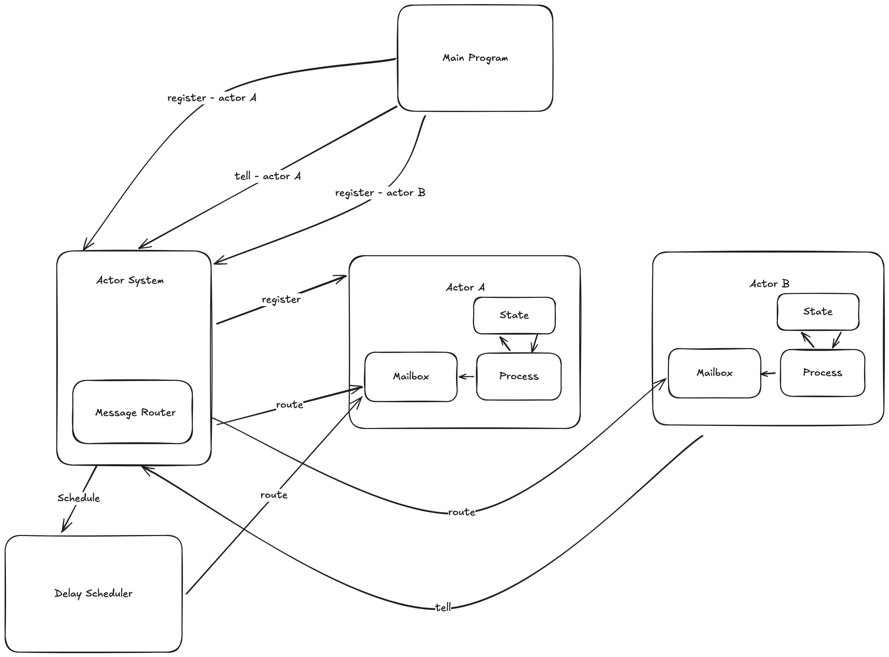

# Cajun

<div style="text-align:center">
    <p>A pluggable actor system written in java leveraging modern features from JDK21+</p>
    
</div>

An actor is a concurrent unit of computation which guarantees serial processing of messages with no need for state
synchronization and coordination. This guarantee of actors mainly comes from the way actors communicate with each other,
each actor send asynchronous messages to other actors and each actor only reads messages from its mailbox.



## Prerequisites
- Java 21+ (with --enable-preview flag)

## Usage

### Creating actors

There are two styles of creating actors, one is the Object-oriented style and Functional style

**Caution: When dealing with state of actors, be sure not to allow mutable objects to escape to external actors, 
this could cause unwanted state mutations, this is mainly due to the nature of referential objects in Java.**

1. Object-oriented style

This is the default way of creating actors, we extend from the `Actor<M>` class and we implement the `receive` method
where we add logic to handle the message and state mutations.

```java
public sealed interface GreetingMessage permits HelloMessage, ByeMessage, GetHelloCount, Shutdown {
}

public record HelloMessage() implements GreetingMessage {
}

public record ByeMessage() implements GreetingMessage {
}

public record Shutdown() implements GreetingMessage {
}

public record GetHelloCount(Pid replyTo) implements GreetingMessage {
}

public class GreetingActor extends Actor<GreetingMessage> {

    private int helloCount;

    public GreetingActor(ActorSystem system, String actorId) {
        super(system, actorId);
        this.helloCount = 0;
    }

    @Override
    public void receive(GreetingMessage message) {
        switch (message) {
            case HelloMessage ignored -> {
                // Updating state of the actor
                helloCount++;
            }
            case GetHelloCount ghc -> {
                // Replying back to calling actor
                ghc.replyTo().tell(new HelloCount(helloCount));
            }
            case ByeMessage ignored -> {
                // Sending a message to self
                self().tell(new Shutdown());
            }
            case Shutdown ignored -> {
                // Stopping actor after processing all messages
                stop();
            }
        }
    }
}
```

2. Functional style actor

When creating a `FunctionalActor` we need to know the State and Message that the actor is going to be using,
then we define call `receiveMessage` on the `FunctionalActor` to program the state changes and message handling logic.
```java
sealed interface CounterProtocol {

    record CountUp() implements CounterProtocol {
    }

    record GetCount(Pid replyTo) implements CounterProtocol {
    }
}

public static void main(String[] args) {
    var counterActor = new FunctionalActor<Integer, CounterProtocol>();
    var counter = actorSystem.register(counterActor.receiveMessage((state, message) -> {
        switch (message) {
            case CounterProtocol.CountUp ignored -> {
                return state + 1;
            }
            case CounterProtocol.GetCount gc -> gc.replyTo().tell(new HelloCount(i));
        }
        return state;
    }, 0), "Counter-Actor");
    var receiverActor = actorSystem.register(CountReceiver.class, "count-receiver-1");
    counter.tell(new CounterProtocol.CountUp());
    counter.tell(new CounterProtocol.CountUp());
    counter.tell(new CounterProtocol.CountUp());
    counter.tell(new CounterProtocol.CountUp());
    counter.tell(new CounterProtocol.GetCount(receiverActor));
}
```

### Using the actor system

After creating the actor we have to use the actor system to spawn them and send messages.

```java

class CountReceiver extends Actor<HelloCount> {

    public CountReceiver(ActorSystem system, String actorId) {
        super(system, actorId);
    }

    @Override
    protected void receive(HelloCount helloCount) {
        System.out.println("Count" + helloCount);
    }
}

public static void main(String[] args) {
    var actorSystem = new ActorSystem();
    var pid1 = actorSystem.register(GreetingActor.class, "greeting-actor-1");
    var receiverActor = actorSystem.register(CountReceiver.class, "count-receiver");
    pid1.tell(new HelloMessage());
    pid1.tell(new GetHelloCount(receiverActor)); // Count: 1
}
```

## Running examples
To run examples in the project, you can leverage the gradle task runner (--enable-preview flag is already enabled 
for gradle tasks)
```shell
./gradlew -PmainClass=examples.TimedCounter run
```

## Error Handling and Supervision Strategy

Cajun provides robust error handling capabilities for actors with a supervision strategy system inspired by Erlang/OTP and Akka.

### Supervision Strategies

The following supervision strategies are available:

- **RESUME**: Continue processing the next message after an error, ignoring the failure (default strategy)
- **RESTART**: Stop and restart the actor after an error, optionally reprocessing the failed message
- **STOP**: Stop the actor completely when an error occurs
- **ESCALATE**: Propagate the error to the parent/system, stopping the current actor

### Example Usage

To set a supervision strategy for an actor:

```
// Create an actor system
ActorSystem system = new ActorSystem();

// Create an actor
Pid actorPid = system.register(MyActor.class, "my-actor-id");

// Get the actor reference and set its supervision strategy
MyActor myActor = (MyActor) system.getActor(actorPid);
myActor.withSupervisionStrategy(Actor.SupervisionStrategy.RESTART);
```

### Hierarchical Supervision

Cajun supports hierarchical supervision, allowing actors to be organized in a parent-child hierarchy. When a child actor fails, the error can be handled by its parent according to the parent's supervision strategy.

#### Creating Child Actors

You can create child actors from within a parent actor:

```
// Inside a parent actor class method
public void createChildren() {
    // Create a child actor with a specific ID
    Pid childPid = this.createChild(ChildActor.class, "child-actor-id");

    // Create a child actor with an auto-generated ID
    Pid anotherChildPid = this.createChild(AnotherChildActor.class);
}
```

You can also register a child actor through the ActorSystem:

```
// Create an actor system
ActorSystem actorSystem = new ActorSystem();

// Create a parent actor
Pid parentPid = actorSystem.register(ParentActor.class, "parent-actor");
ParentActor parent = (ParentActor) actorSystem.getActor(parentPid);

// Register a child actor with the parent
Pid childPid = actorSystem.registerChild(ChildActor.class, "child-actor", parent);
```

#### Supervision Hierarchy

When a child actor fails with the ESCALATE strategy, the error is propagated to its parent. The parent then applies its own supervision strategy to handle the child's failure:

1. If the parent uses RESUME, the child actor is restarted and continues processing
2. If the parent uses RESTART, the child actor is restarted
3. If the parent uses STOP, the child actor remains stopped
4. If the parent uses ESCALATE, the error continues up the hierarchy

#### Hierarchical Shutdown

When a parent actor is stopped, all its child actors are automatically stopped as well, ensuring proper cleanup of resources.

### Lifecycle Hooks

Actors provide lifecycle hooks that you can override for custom behavior:

- `preStart()`: Called before the actor starts processing messages
- `postStop()`: Called after the actor has stopped processing messages
- `onError(Message message, Throwable exception)`: Called when an exception occurs during message processing

### Error Propagation

The `ActorException` class is used for error propagation, particularly when using the ESCALATE supervision strategy. It captures the actor ID and original exception for better error handling.

## Feature roadmap

1. Actor system and actor lifecycle
   - [x] Create Actor and Actor System
   - [x] Support message to self for actor
   - [x] Support hooks for start and shutdown of actor
   - [x] Stateful functional style actor
   - [x] Timed messages
   - [x] Error handling with supervision strategies
2. Actor metadata management with etcd
3. Actor supervision hierarchy and fault tolerance
   - [x] Basic supervision strategies (RESUME, RESTART, STOP, ESCALATE)
   - [x] Hierarchical supervision
   - [ ] Custom supervision policies
4. Persistent state and messaging for actors
5. Partitioned state and sharding strategy
