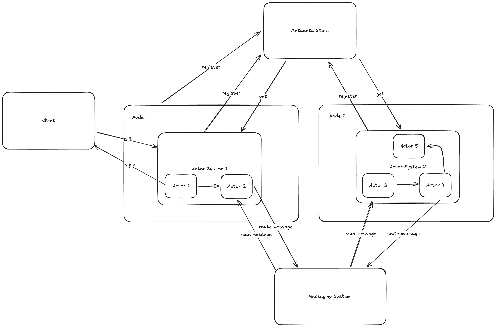

# Cajun

<div style="text-align:center">
    <p>A pluggable actor system written in Java leveraging modern features from JDK21+</p>
    
</div>

## Table of Contents
- [Introduction](#introduction)
- [Prerequisites](#prerequisites)
- [Installation](#installation)
- [Usage](#usage)
  - [Creating Actors](#creating-actors)
  - [Using the Actor System](#using-the-actor-system)
  - [Running Examples](#running-examples)
- [Message Processing and Performance Tuning](#message-processing-and-performance-tuning)
- [Error Handling and Supervision Strategy](#error-handling-and-supervision-strategy)
- [Stateful Actors and Persistence](#stateful-actors-and-persistence)
  - [State Persistence](#state-persistence)
  - [Message Persistence and Replay](#message-persistence-and-replay)
- [Cluster Mode](#cluster-mode)
- [Feature Roadmap](#feature-roadmap)

## Introduction

Cajun is a lightweight, high-performance actor system for Java applications that leverages modern Java features to provide a simple yet powerful concurrency model. It's designed to make concurrent programming easier and more reliable by using the actor model.

An actor is a concurrent unit of computation which guarantees serial processing of messages with no need for state
synchronization and coordination. This guarantee of actors mainly comes from the way actors communicate with each other,
each actor sends asynchronous messages to other actors and each actor only reads messages from its mailbox.

Key benefits of using Cajun:
- **Simplified Concurrency**: No locks, no synchronized blocks, no race conditions
- **Scalability**: Easily scale from single-threaded to multi-threaded to distributed systems
- **Fault Tolerance**: Built-in supervision strategies for handling failures
- **Flexibility**: Multiple programming styles (OO, functional, stateful)
- **Performance**: High-throughput message processing with batching support


> **Dedication**: Cajun is inspired by Erlang OTP and the actor model, and is dedicated to the late Joe Armstrong from Ericsson, whose pioneering work on Erlang and the actor model has influenced a generation of concurrent programming systems. Additional inspiration comes from Akka/Pekko.

## Prerequisites
- Java 21+ (with --enable-preview flag)

## Installation

Add Cajun to your project using Gradle:

```gradle
dependencies {
    implementation 'systems.cajun:cajun-core:latest.release'
}
```

Or with Maven:

```xml
<dependency>
    <groupId>systems.cajun</groupId>
    <artifactId>cajun-core</artifactId>
    <version>latest.release</version>
</dependency>
```

## Usage

### Creating Actors

There are multiple styles of creating actors in Cajun:

1. Object-oriented style

This is the default way of creating actors, we extend from the `Actor<M>` class and we implement the `receive` method
where we add logic to handle the message and state mutations.

```java
public sealed interface GreetingMessage permits HelloMessage, ByeMessage, GetHelloCount, Shutdown {
}

public record HelloMessage() implements GreetingMessage {
}

public record ByeMessage() implements GreetingMessage {
}

public record Shutdown() implements GreetingMessage {
}

public record GetHelloCount(Pid replyTo) implements GreetingMessage {
}

public class GreetingActor extends Actor<GreetingMessage> {

    private int helloCount;

    public GreetingActor(ActorSystem system, String actorId) {
        super(system, actorId);
        this.helloCount = 0;
    }

    @Override
    public void receive(GreetingMessage message) {
        switch (message) {
            case HelloMessage ignored -> {
                // Updating state of the actor
                helloCount++;
            }
            case GetHelloCount ghc -> {
                // Replying back to calling actor
                ghc.replyTo().tell(new HelloCount(helloCount));
            }
            case ByeMessage ignored -> {
                // Sending a message to self
                self().tell(new Shutdown());
            }
            case Shutdown ignored -> {
                // Stopping actor after processing all messages
                stop();
            }
        }
    }
}
```

2. Workflow Chaining with ChainedActor

For creating workflow-style actors that process messages in a chain, use the `ChainedActor<M>` class. This provides methods for connecting actors in a sequence and forwarding messages to the next actor in the chain.

```java
public class ProcessorActor extends ChainedActor<WorkflowMessage> {
    
    public ProcessorActor(ActorSystem system, String actorId) {
        super(system, actorId);
    }
    
    @Override
    protected void receive(WorkflowMessage message) {
        // Process the message
        WorkflowMessage processedMessage = processMessage(message);
        
        // Forward to the next actor in the chain
        forward(processedMessage);
    }
    
    private WorkflowMessage processMessage(WorkflowMessage message) {
        // Your processing logic here
        return message;
    }
}
```

To set up a chain of actors:

```java
// Create a chain of processor actors
Pid firstProcessorPid = system.createActorChain(ProcessorActor.class, "processor", 3);

// Create source and sink actors
Pid sourcePid = system.register(SourceActor.class, "source");
Pid sinkPid = system.register(SinkActor.class, "sink");

// Connect source to the first processor
ChainedActor<?> sourceActor = (ChainedActor<?>) system.getActor(sourcePid);
sourceActor.withNext(firstProcessorPid);

// Connect the last processor to the sink
ChainedActor<?> lastProcessor = (ChainedActor<?>) system.getActor(new Pid("processor-3", system));
lastProcessor.withNext(sinkPid);
```

The `ActorSystem` provides a convenient method to create chains of actors:

```java
// Creates 5 processor actors and connects them in sequence
Pid firstActorPid = system.createActorChain(ProcessorActor.class, "processor", 5);
```

3. Functional style actor

When creating a `FunctionalActor` we need to know the State and Message that the actor is going to be using,
then we define call `receiveMessage` on the `FunctionalActor` to program the state changes and message handling logic.
```java
sealed interface CounterProtocol {

    record CountUp() implements CounterProtocol {
    }

    record GetCount(Pid replyTo) implements CounterProtocol {
    }
}

public static void main(String[] args) {
    var counterActor = new FunctionalActor<Integer, CounterProtocol>();
    var counter = actorSystem.register(counterActor.receiveMessage((state, message) -> {
        switch (message) {
            case CounterProtocol.CountUp ignored -> {
                return state + 1;
            }
            case CounterProtocol.GetCount gc -> gc.replyTo().tell(new HelloCount(i));
        }
        return state;
    }, 0), "Counter-Actor");
    var receiverActor = actorSystem.register(CountReceiver.class, "count-receiver-1");
    counter.tell(new CounterProtocol.CountUp());
    counter.tell(new CounterProtocol.CountUp());
    counter.tell(new CounterProtocol.CountUp());
    counter.tell(new CounterProtocol.CountUp());
    counter.tell(new CounterProtocol.GetCount(receiverActor));
}
```

#### Key Features of StatefulActor

- **Persistent State**: State is automatically persisted using configurable storage backends
- **State Recovery**: Automatically recovers state when an actor restarts
- **Type Safety**: Generic type parameters for both state and message types
- **Pluggable Storage**: Supports different state storage implementations:
  - In-memory storage (default)
  - File-based storage
  - Custom storage implementations

#### Using StatefulActor

1. **Creating a StatefulActor**

```java
// Create with default in-memory persistence
CounterActor counterActor = new CounterActor(system, "counter", 0);
counterActor.start();

// Create with file-based persistence
StateStore<String, Integer> stateStore = StateStoreFactory.createFileStore("/path/to/state/dir");
CounterActor persistentActor = new CounterActor(system, "persistent-counter", 0, stateStore);
persistentActor.start();
```

2. **Functional Style StatefulActor**

You can also create stateful actors using a functional style:

```java
// Create a stateful actor with functional style
Pid counterPid = FunctionalStatefulActor.createStatefulActor(
    system,                  // Actor system
    "counter",               // Actor ID
    0,                       // Initial state
    (state, message) -> {    // Message handler function
        if (message instanceof CounterMessage.Increment) {
            return state + 1;
        } else if (message instanceof CounterMessage.Reset) {
            return 0;
        }
        return state;
    }
);
```

3. **Creating Chains of StatefulActors**

The `FunctionalStatefulActor` utility allows creating chains of stateful actors that process messages in sequence:

```java
// Create a chain of stateful actors
Pid firstActorPid = FunctionalStatefulActor.createChain(
    system,                  // Actor system
    "counter-chain",         // Base name for the chain
    3,                       // Number of actors in the chain
    new Integer[]{0, 0, 0},  // Initial states for each actor
    new BiFunction[]{        // Message handlers for each actor
        (state, msg) -> { /* Actor 1 logic */ },
        (state, msg) -> { /* Actor 2 logic */ },
        (state, msg) -> { /* Actor 3 logic */ }
    }
);
```

#### State Management Methods

StatefulActor provides several methods for working with state:

- `getState()`: Get the current state value
- `updateState(State newState)`: Update the state with a new value
- `updateState(Function<State, State> updateFunction)`: Update the state using a function

#### Lifecycle Hooks

StatefulActor overrides the standard Actor lifecycle hooks:

- `preStart()`: Initializes the actor's state from the state store
- `postStop()`: Ensures the final state is persisted before stopping

### Using the actor system

After creating the actor we have to use the actor system to spawn them and send messages.

```java

class CountReceiver extends Actor<HelloCount> {

    public CountReceiver(ActorSystem system, String actorId) {
        super(system, actorId);
    }

    @Override
    protected void receive(HelloCount helloCount) {
        System.out.println("Count" + helloCount);
    }
}

public static void main(String[] args) {
    var actorSystem = new ActorSystem();
    var pid1 = actorSystem.register(GreetingActor.class, "greeting-actor-1");
    var receiverActor = actorSystem.register(CountReceiver.class, "count-receiver");
    pid1.tell(new HelloMessage());
    pid1.tell(new GetHelloCount(receiverActor)); // Count: 1
}
```

## Running examples
To run examples in the project, you can leverage the gradle task runner (--enable-preview flag is already enabled 
for gradle tasks)
```shell
./gradlew -PmainClass=examples.TimedCounter run
```

## Message Processing and Performance Tuning

### Batched Message Processing

Cajun supports batched processing of messages to improve throughput:

- By default, each actor processes messages in batches of 10 messages at a time
- Batch processing can significantly improve throughput by reducing context switching overhead
- You can configure the batch size for any actor using the `withBatchSize()` method

```java
// Create an actor with custom batch size
var myActor = actorSystem.register(MyActor.class, "my-actor");
((MyActor)actorSystem.getActor(myActor)).withBatchSize(50);  // Process 50 messages at a time
```

#### Tuning Considerations:

- **Larger batch sizes**: Improve throughput but may increase latency for individual messages
- **Smaller batch sizes**: Provide more responsive processing but with lower overall throughput
- **Workload characteristics**: CPU-bound tasks benefit from larger batches, while I/O-bound tasks may work better with smaller batches
- **Memory usage**: Larger batches consume more memory as messages are held in memory during processing

### Running Performance Tests

The project includes performance tests that can help you evaluate different configurations:

```shell
# Run all performance tests
./gradlew test -PincludeTags="performance"

# Run a specific performance test
./gradlew test --tests "systems.cajun.performance.ActorPerformanceTest.testActorChainThroughput"
```

The performance tests measure:

1. **Actor Chain Throughput**: Tests message passing through a chain of actors
2. **Many-to-One Throughput**: Tests many sender actors sending to a single receiver
3. **Actor Lifecycle Performance**: Tests creation and stopping of large numbers of actors

These tests can help you determine optimal configurations for your specific use case.

## Error Handling and Supervision Strategy

Cajun provides robust error handling capabilities for actors with a supervision strategy system inspired by Erlang/OTP and Akka.

### Supervision Strategies

The following supervision strategies are available:

- **RESUME**: Continue processing the next message after an error, ignoring the failure (default strategy)
- **RESTART**: Stop and restart the actor after an error, optionally reprocessing the failed message
- **STOP**: Stop the actor completely when an error occurs
- **ESCALATE**: Propagate the error to the parent/system, stopping the current actor

### Example Usage

To set a supervision strategy for an actor:

```java
// Create an actor system
ActorSystem system = new ActorSystem();

// Create an actor
Pid actorPid = system.register(MyActor.class, "my-actor-id");

// Get the actor reference and set its supervision strategy
MyActor myActor = (MyActor) system.getActor(actorPid);
myActor.withSupervisionStrategy(Actor.SupervisionStrategy.RESTART);
```

### Hierarchical Supervision

Cajun supports hierarchical supervision, allowing actors to be organized in a parent-child hierarchy. When a child actor fails, the error can be handled by its parent according to the parent's supervision strategy.

#### Creating Child Actors

You can create child actors from within a parent actor:

```java
// Inside a parent actor class method
public void createChildren() {
    // Create a child actor with a specific ID
    Pid childPid = this.createChild(ChildActor.class, "child-actor-id");

    // Create a child actor with an auto-generated ID
    Pid anotherChildPid = this.createChild(AnotherChildActor.class);
}
```

You can also register a child actor through the ActorSystem:

```java
// Create an actor system
ActorSystem actorSystem = new ActorSystem();

// Create a parent actor
Pid parentPid = actorSystem.register(ParentActor.class, "parent-actor");
ParentActor parent = (ParentActor) actorSystem.getActor(parentPid);

// Register a child actor with the parent
Pid childPid = actorSystem.registerChild(ChildActor.class, "child-actor", parent);
```

#### Supervision Hierarchy

When a child actor fails with the ESCALATE strategy, the error is propagated to its parent. The parent then applies its own supervision strategy to handle the child's failure:

1. If the parent uses RESUME, the child actor is restarted and continues processing
2. If the parent uses RESTART, the child actor is restarted
3. If the parent uses STOP, the child actor remains stopped
4. If the parent uses ESCALATE, the error continues up the hierarchy

#### Hierarchical Shutdown

When a parent actor is stopped, all its child actors are automatically stopped as well, ensuring proper cleanup of resources.

### Lifecycle Hooks

Actors provide lifecycle hooks that you can override for custom behavior:

- `preStart()`: Called before the actor starts processing messages
- `postStop()`: Called after the actor has stopped processing messages
- `onError(Message message, Throwable exception)`: Called when an exception occurs during message processing

### Error Propagation

The `ActorException` class is used for error propagation, particularly when using the ESCALATE supervision strategy. It captures the actor ID and original exception for better error handling.

## Stateful Actors and Persistence

### State Persistence

Cajun provides built-in support for state persistence in stateful actors. The `StatefulActor` class extends the base `Actor` class with state management capabilities, allowing actors to maintain and persist their state across restarts.

#### Serialization Requirements

**IMPORTANT**: For persistence to work correctly, both the State and Message types MUST be serializable:

- Both State and Message classes must implement `java.io.Serializable`
- All fields in these classes must also be serializable, or marked as `transient`
- For non-serializable fields (like lambdas or functional interfaces), use `transient` and implement custom serialization with `readObject`/`writeObject` methods
- Add `serialVersionUID` to all serializable classes to maintain compatibility

Failure to meet these requirements will result in `NotSerializableException` during message journaling or state snapshot operations.

```java
// Example of a properly serializable message class
public sealed interface CounterMessage extends java.io.Serializable permits 
        CounterMessage.Increment, CounterMessage.Reset, CounterMessage.GetCount {
    
    record Increment() implements CounterMessage {
        private static final long serialVersionUID = 1L;
    }
    
    record Reset() implements CounterMessage {
        private static final long serialVersionUID = 1L;
    }
    
    // Example of handling non-serializable fields
    final class GetCount implements CounterMessage {
        private static final long serialVersionUID = 1L;
        // Consumer is not Serializable by default, so mark it transient
        private transient java.util.function.Consumer<Integer> callback;
        
        public GetCount(java.util.function.Consumer<Integer> callback) {
            this.callback = callback;
        }
        
        // Custom deserialization to handle the transient field
        private void readObject(java.io.ObjectInputStream in) throws java.io.IOException, ClassNotFoundException {
            in.defaultReadObject();
            // Provide a default value after deserialization
            if (callback == null) {
                callback = (i) -> {};
            }
        }
    }
}
```

The state is persisted using a configurable `StateStore` implementation. Cajun provides several built-in state stores:

- `InMemoryStateStore`: Stores state in memory (useful for testing)
- `FileStateStore`: Persists state to disk

You can also implement custom state stores by implementing the `StateStore` interface.

### Message Persistence and Replay

Cajun supports message persistence and replay for stateful actors using a Write-Ahead Log (WAL) style approach. This enables actors to recover their state by replaying messages after a restart or crash.

#### Key Features

- **Message Journaling**: All messages are logged to a journal before processing
- **Snapshots**: Periodic snapshots of actor state to avoid replaying all messages
- **Recovery**: Automatic state recovery using the latest snapshot plus replay of subsequent messages
- **Compaction**: Journal entries included in snapshots are automatically removed to save space

#### How It Works

1. **Message Processing**:
   - When a message is received, it's first logged to the message journal
   - The message is then processed, potentially changing the actor's state
   - State changes are tracked internally
   - Snapshots of the state are taken at configurable intervals (default: 15 seconds)

2. **Recovery Process**:
   - When an actor starts, it attempts to recover its state from the latest snapshot
   - If a snapshot exists, it loads the state from the snapshot
   - It then replays all messages from the journal with sequence numbers higher than the snapshot
   - If no snapshot exists, it starts with the initial state and replays all messages
   - The actor ensures state initialization is complete before processing new messages

#### Example Usage

```java
// Create a stateful actor with message persistence and replay
CounterActor actor = new CounterActor(
    actorSystem,                             // Actor system
    "counter-1",                             // Actor ID
    new CounterState(0),                     // Initial state
    PersistenceFactory.createFileMessageJournal(),  // Message journal
    PersistenceFactory.createFileSnapshotStore()    // Snapshot store
);

// Start the actor and ensure state is initialized
actor.start();
actor.forceInitializeState().join();

// Send messages to the actor
actor.tell("increment");
actor.tell("increment");

// Force a snapshot
actor.forceSnapshot().join();

// Even if the actor is stopped and restarted, it will recover its state
actor.stop();

// Create a new actor with the same ID
// Note: null initial state forces recovery from persistence
CounterActor newActor = new CounterActor(
    actorSystem,
    "counter-1",
    null,  // null initial state forces recovery
    PersistenceFactory.createFileMessageJournal(),
    PersistenceFactory.createFileSnapshotStore()
);

// Start the actor and ensure state is initialized
newActor.start();
newActor.forceInitializeState().join();

// The actor will automatically recover its state
// newActor.getCurrentValue() will return 2
```

#### Configuration

You can configure the persistence behavior with the following parameters:

- **Snapshot Interval**: How often snapshots are taken (default: 15 seconds)
- **Custom Persistence**: You can provide custom implementations of `MessageJournal` and `SnapshotStore`

#### Benefits

- **Durability**: Actor state can survive process restarts and crashes
- **Consistency**: Ensures that actor state is consistent after recovery
- **Performance**: Efficient recovery using snapshots and incremental replay
- **Reliability**: Explicit state initialization ensures deterministic behavior
- **Flexibility**: Pluggable storage backends for different use cases

## Cluster Mode



Cajun supports running in a cluster mode where actors can be distributed across multiple nodes, with automatic failover and recovery.

### Setting Up Cluster Mode

```java
// Create a metadata store (using etcd)
MetadataStore metadataStore = new EtcdMetadataStore("http://localhost:2379");

// Create a messaging system (using direct TCP)
MessagingSystem messagingSystem = new DirectMessagingSystem("system1", 8080);

// Create a cluster actor system
ClusterActorSystem system = new ClusterActorSystem("system1", metadataStore, messagingSystem);

// Start the system
system.start().get();

// Create actors as usual
Pid actor = system.register(MyActor.class, "my-actor");

// Send messages as usual
actor.tell("Hello, actor!");

// Shut down the system when done
system.stop().get();
```

### Key Features

#### Distributed Actor Assignment

Actors are assigned to nodes in the cluster using rendezvous hashing, which provides a consistent distribution even when nodes join or leave the cluster.

```java
// Create an actor on a specific node
Pid actor = system.createActorOnNode(MyActor.class, "my-actor", "node2");
```

#### Leader Election

A leader node is elected using a distributed lock in the metadata store. The leader is responsible for managing actor assignments and handling node failures.

```java
// Check if this node is the leader
if (system.isLeader()) {
    // Perform leader-specific tasks
}
```

#### Remote Messaging

Messages can be sent to actors regardless of which node they're running on. The system automatically routes messages to the correct node.

```java
// Send a message to an actor (works the same whether the actor is local or remote)
actor.tell("Hello, actor!");
```

#### Fault Tolerance

When a node fails, its actors are automatically reassigned to other nodes in the cluster.

### Multiple Nodes Example

```java
// Node 1
MetadataStore metadataStore1 = new EtcdMetadataStore("http://etcd-host:2379");
DirectMessagingSystem messagingSystem1 = new DirectMessagingSystem("node1", 8080);
messagingSystem1.addNode("node2", "node2-host", 8080);
ClusterActorSystem system1 = new ClusterActorSystem("node1", metadataStore1, messagingSystem1);
system1.start().get();

// Node 2
MetadataStore metadataStore2 = new EtcdMetadataStore("http://etcd-host:2379");
DirectMessagingSystem messagingSystem2 = new DirectMessagingSystem("node2", 8080);
messagingSystem2.addNode("node1", "node1-host", 8080);
ClusterActorSystem system2 = new ClusterActorSystem("node2", metadataStore2, messagingSystem2);
system2.start().get();
```
For more details refer to [Cluster Mode](docs/cluster_mode.md).

### Extending the System

#### Custom Metadata Store

You can implement your own metadata store by implementing the `MetadataStore` interface:

```java
public class CustomMetadataStore implements MetadataStore {
    // Implement the required methods
}
```

#### Custom Messaging System

You can implement your own messaging system by implementing the `MessagingSystem` interface:

```java
public class CustomMessagingSystem implements MessagingSystem {
    // Implement the required methods
}
```

For more details, see the [Cluster Mode Improvements documentation](docs/cluster_mode_improvements.md).

## Feature roadmap

1. Actor system and actor lifecycle
   - [x] Create Actor and Actor System
   - [x] Support message to self for actor
   - [x] Support hooks for start and shutdown of actor
   - [x] Stateful functional style actor
   - [x] Timed messages
   - [x] Error handling with supervision strategies
2. Actor metadata management with etcd
   - [x] Distributed metadata store with etcd support
   - [x] Leader election
   - [x] Actor assignment tracking
3. Actor supervision hierarchy and fault tolerance
   - [x] Basic supervision strategies (RESUME, RESTART, STOP, ESCALATE)
   - [x] Hierarchical supervision
   - [ ] Custom supervision policies
4. Persistent state and messaging for actors
   - [x] StatefulActor with persistent state management
   - [x] Pluggable state storage backends (in-memory, file-based)
   - [ ] Message persistence and replay
5. Partitioned state and sharding strategy
   - [x] Rendezvous hashing for actor assignment
6. Cluster mode
   - [x] Distributed actor systems
   - [x] Remote messaging between actor systems
   - [x] Actor reassignment on node failure
   - [x] Pluggable messaging system
   - [x] Configurable message delivery guarantees (EXACTLY_ONCE, AT_LEAST_ONCE, AT_MOST_ONCE)
