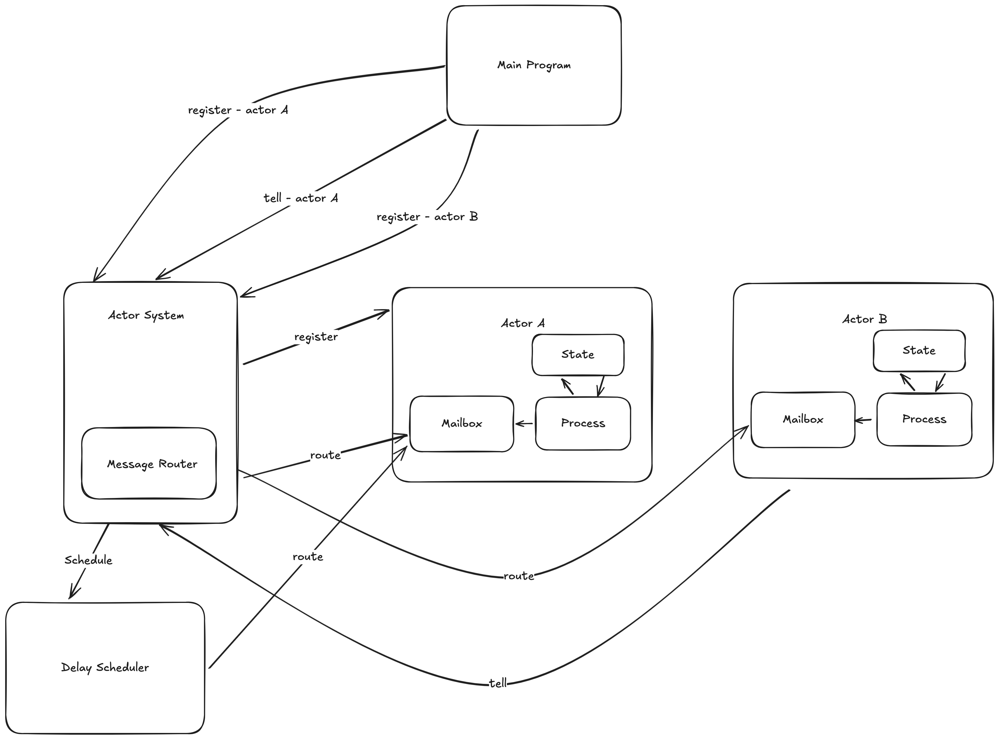

# Cajun - **C**oncurrency **A**nd **J**ava **UN**locked

<div style="text-align:center">
    <p>Predictable concurrency for Java applications using the actor model</p>
    <p><em>Leveraging virtual threads and modern features from JDK21+</em></p>
    
</div>

📚 **[Full Documentation](https://cajunsystems.github.io)** | 🚀 [Quick Start](#quick-start-5-minutes) | 📦 [Installation](#installation)

## Table of Contents

### Getting Started
- [What is Cajun?](#what-is-cajun)
- [Quick Start (5 Minutes)](#quick-start-5-minutes)
- [Prerequisites](#prerequisites)
- [Installation](#installation)

### Core Concepts
- [Understanding Actors](#understanding-actors)
- [Creating Your First Actors](#creating-your-first-actors)
  - [Stateless Actors](#stateless-actors-with-handler-interface)
  - [Stateful Actors](#stateful-actors-with-statefulhandler-interface)
  - [Functional Actors with Effects](#functional-actors-with-effects)
  - [Actor Hierarchies](#creating-actor-hierarchies)
- [Actor ID Strategies](#actor-id-strategies)
  - [Explicit IDs](#explicit-ids)
  - [ID Templates](#id-templates)
  - [ID Strategies](#predefined-id-strategies)
  - [Hierarchical IDs](#hierarchical-ids)
- [Actor Communication](#actor-communication)
  - [Sending Messages (tell)](#sending-messages-to-self)
  - [Request-Response (ask)](#request-response-with-ask-pattern)
  - [Message Forwarding](#sender-context-and-message-forwarding)
- [Actor Lifecycle](#actor-system-lifecycle)

### Essential Features
- [Stateful Actors](#stateful-actors-and-persistence)
  - [State Management](#state-persistence)
  - [Persistence and Recovery](#message-persistence-and-replay)
  - [LMDB Persistence](#lmdb-persistence-recommended-for-production)
- [Error Handling and Supervision](#error-handling-and-supervision-strategy)
- [Testing Your Actors](#testing)

### Intermediate Topics
- [Performance and Tuning](#message-processing-and-performance-tuning)
  - [Batch Processing](#batched-message-processing)
  - [Thread Pool Configuration](#configurable-thread-pools)
  - [Mailbox Configuration](#mailbox-configuration)
    - [Available Mailbox Types](#available-mailbox-types)
- [Advanced Communication Patterns](#actorcontext-convenience-features)
  - [Sender Context](#sender-context-and-message-forwarding)
  - [ReplyingMessage Interface](#standardized-reply-pattern-with-replyingmessage)

### Advanced Features
- [Backpressure Management](#backpressure-support-in-actors)
- [Cluster Mode (Distributed Actors)](#cluster-mode)
- [Direct-Style API (Inspired by Ox)](#direct-style-api-inspired-by-ox)
  - [Supervised Scopes](#supervised-scopes)
  - [Direct-Style Actors](#direct-style-actors)
  - [Typed Channels](#typed-channels)
  - [Migration Guide](#migrating-to-direct-style)

### Reference
- [Performance Benchmarks](#benchmarks)
  - [Persistence Benchmarks](#persistence-benchmarks)
- [Running Examples](#running-examples)
- [Feature Roadmap](#feature-roadmap)

## What is Cajun?

Cajun (**C**oncurrency **A**nd **J**ava **UN**locked) is a lightweight actor system for Java that makes concurrent programming **simple and safe**. Instead of managing threads, locks, and shared state yourself, you write simple actors that communicate through messages.

### Why Actors?

**Traditional concurrent programming is hard:**
- 🔒 Managing locks and synchronization
- 🐛 Avoiding race conditions and deadlocks
- 🔍 Debugging concurrent issues
- 📊 Coordinating shared state

**Actors make it simple:**
- ✅ Each actor processes one message at a time
- ✅ No shared state = no race conditions
- ✅ Built-in error handling and recovery
- ✅ Easy to test and reason about

### When Should You Use Cajun?

**✅ Perfect for (Near-Zero Overhead):**
- **I/O-Heavy Applications**: Microservices, web apps, REST APIs
  - **Performance**: 0.02% overhead - actors perform identically to raw threads!
  - Database calls, HTTP requests, file operations
- **Event-Driven Systems**: Kafka/RabbitMQ consumers, event processing
  - **Performance**: 0.02% overhead for I/O-bound message processing
  - Excellent for stream processing and event sourcing
- **Stateful Services**: User sessions, game entities, shopping carts
  - **Performance**: 8% overhead but you get thread-safe state management
  - Complex stateful logic that needs isolation
- **Message-Driven Architectures**: Workflows, sagas, orchestration
  - **Performance**: < 1% overhead for realistic mixed workloads
  - Systems requiring fault tolerance and supervision

**⚠️ Consider alternatives for:**
- **Embarrassingly Parallel CPU Work**: Matrix multiplication, data transformations
  - Raw threads are 10x faster for pure parallel computation
  - Use parallel streams or thread pools instead
- **Simple Scatter-Gather**: No state, just parallel work and collect results
  - Threads are 38% faster for this specific pattern
  - CompletableFuture composition is simpler

**Key Insight**: Cajun uses virtual threads, which excel at I/O-bound workloads (databases, networks, files). For typical microservices and web applications, actor overhead is **negligible** (< 1%) while providing superior architecture benefits.

### How Cajun Works

Cajun uses the **actor model** to provide predictable concurrency:

1. **Message Passing**: Actors communicate by sending messages (no shared state)
2. **Isolated State**: Each actor owns its state privately
3. **Serial Processing**: Messages are processed one at a time, in order
4. **No User-Level Locks**: You write lock-free code - the actor model handles isolation

**Built on Java 21+ Virtual Threads:**
Cajun leverages virtual threads for exceptional I/O performance. Each actor runs on a virtual thread, allowing you to create thousands of concurrent actors with minimal overhead.

**Performance Profile (Benchmarked November 2025):**
- **I/O-Bound Workloads**: **0.02% overhead** - essentially identical to raw threads!
  - Perfect for microservices, web applications, database operations
  - Virtual threads "park" during I/O instead of blocking OS threads
- **CPU-Bound Workloads**: **8% overhead** - excellent for stateful operations
  - Acceptable trade-off for built-in state management and fault tolerance
- **Mixed Workloads**: **< 1% overhead** - ideal for real-world applications
  - Typical request handling (DB + business logic + rendering)

**Thread Pool Configuration:** Virtual threads are the default and perform best across all tested scenarios. You can optionally configure different thread pools per actor, but benchmarks show virtual threads outperform fixed and work-stealing pools for actor workloads.

**Note**: While your application code doesn't use locks, the JVM and mailbox implementations may use locks internally. The key benefit is that **you** don't need to manage synchronization.

### Key Benefits

- **No User-Level Locks**: Write concurrent code without explicit locks, synchronized blocks, or manual coordination - the actor model handles isolation
- **Predictable Behavior**: Deterministic message ordering makes systems easier to reason about and test
- **Exceptional I/O Performance**: **0.02% overhead** for I/O-bound workloads - actors perform identically to raw threads for microservices and web apps
- **Scalability**: Easily scale from single-threaded to multi-threaded to distributed systems
  - Virtual threads enable thousands of concurrent actors with minimal overhead
- **Fault Tolerance**: Built-in supervision strategies for handling failures gracefully
- **Flexibility**: Multiple programming styles (OO, functional, stateful) to match your needs
- **Production-Ready Performance**: 
  - I/O workloads: 0.02% overhead (negligible)
  - CPU workloads: 8% overhead (excellent for state management)
  - Mixed workloads: < 1% overhead (ideal for real applications)
- **Virtual Thread Based**: Built on Java 21+ virtual threads for efficient blocking I/O with simple, natural code
- **Simple Defaults**: All default configurations are optimal - no tuning required for 99% of use cases



> **Dedication**: Cajun is inspired by Erlang OTP and the actor model, and is dedicated to the late Joe Armstrong from Ericsson, whose pioneering work on Erlang and the actor model has influenced a generation of concurrent programming systems. Additional inspiration comes from Akka/Pekko.

## Quick Start (5 Minutes)

Get up and running with Cajun in just a few minutes!

### Prerequisites
- Java 21+ (with --enable-preview flag)

### Installation

Cajun is available on Maven Central. Add it to your project using Gradle:

```gradle
dependencies {
    implementation 'com.cajunsystems:cajun:0.4.0'
}
```

Or with Maven:

```xml
<dependency>
    <groupId>com.cajunsystems</groupId>
    <artifactId>cajun</artifactId>
    <version>0.4.0</version>
</dependency>
```

**Note**: Since Cajun uses Java preview features, you need to enable preview features in your build:

**Gradle:**
```gradle
tasks.withType(JavaCompile) {
    options.compilerArgs.add('--enable-preview')
}

tasks.withType(JavaExec) {
    jvmArgs += '--enable-preview'
}

tasks.withType(Test) {
    jvmArgs += '--enable-preview'
}
```

**Maven:**
```xml
<build>
    <plugins>
        <plugin>
            <groupId>org.apache.maven.plugins</groupId>
            <artifactId>maven-compiler-plugin</artifactId>
            <version>3.11.0</version>
            <configuration>
                <compilerArgs>
                    <arg>--enable-preview</arg>
                </compilerArgs>
            </configuration>
        </plugin>
        <plugin>
            <groupId>org.apache.maven.plugins</groupId>
            <artifactId>maven-surefire-plugin</artifactId>
            <version>3.0.0</version>
            <configuration>
                <argLine>--enable-preview</argLine>
            </configuration>
        </plugin>
    </plugins>
</build>
```

### Your First Actor

Here's a complete, runnable example to get you started:

```java
import com.cajunsystems.*;
import com.cajunsystems.handler.Handler;

public class HelloWorld {
    
    // Define your message types with explicit replyTo
    public record HelloMessage(String name, Pid replyTo) {}
    public record GreetingResponse(String greeting) {}
    
    // Greeter actor that processes requests
    public static class GreeterHandler implements Handler<HelloMessage> {
        @Override
        public void receive(HelloMessage message, ActorContext context) {
            context.getLogger().info("Received greeting request for: {}", message.name());
            
            // Process and reply
            String greeting = "Hello, " + message.name() + "!";
            context.tell(message.replyTo(), new GreetingResponse(greeting));
        }
    }
    
    // Receiver actor that handles responses
    public static class ReceiverHandler implements Handler<GreetingResponse> {
        @Override
        public void receive(GreetingResponse message, ActorContext context) {
            System.out.println("Received: " + message.greeting());
        }
    }
    
    public static void main(String[] args) throws Exception {
        // 1. Create the ActorSystem
        ActorSystem system = new ActorSystem();
        
        // 2. Spawn actors
        Pid greeter = system.actorOf(GreeterHandler.class)
            .withId("greeter")
            .spawn();
        
        Pid receiver = system.actorOf(ReceiverHandler.class)
            .withId("receiver")
            .spawn();
        
        // 3. Send a message with explicit replyTo
        greeter.tell(new HelloMessage("World", receiver));
        
        // Wait a bit for async processing
        Thread.sleep(100);
        
        // 4. Shutdown the system when done
        system.shutdown();
    }
}
```

**What's happening here?**
1. We create an `ActorSystem` - the container for all actors
2. We spawn two actors using `actorOf()` - one greeter and one receiver
3. We send a message using `tell()` - fire-and-forget messaging
4. The greeter processes the message and replies to the receiver
5. We shut down the system when done

**Next steps:** See [Request-Response with Ask Pattern](#request-response-with-ask-pattern) for a simpler approach to request-response, or continue reading to understand actors in depth.

---

## Understanding Actors

### What is an Actor?

An **actor** is a lightweight concurrent unit that:
- Has its own private state (no sharing with other actors)
- Processes messages one at a time, in order
- Communicates only through asynchronous messages
- Can create other actors (children)
- Never blocks other actors

Think of actors like people in an organization - they each have their own desk (state), inbox (mailbox), and can send memos (messages) to each other, but they never directly access another person's desk.

### Actor Lifecycle

**Important**: The Cajun actor system keeps the JVM alive after the main method completes. This is the expected behavior for a production actor system.

- **JVM Stays Alive**: The actor system uses a non-daemon keep-alive thread that keeps the JVM running even after the main thread exits. This ensures actors can continue processing messages, even when using virtual threads (which are always daemon threads).
- **Virtual Thread Support**: Actors run on virtual threads by default for optimal I/O-bound workloads. The keep-alive mechanism ensures the JVM doesn't exit prematurely despite virtual threads being daemon threads.
- **Explicit Shutdown Required**: You must call `system.shutdown()` to gracefully shut down the actor system and allow the JVM to exit.

```java
public static void main(String[] args) {
    ActorSystem system = new ActorSystem();
    
    Pid actor = system.actorOf(new Handler<String>() {
        @Override
        public void receive(String message, ActorContext context) {
            System.out.println("Received: " + message);
        }
    }).withId("demo-actor").spawn();
    
    actor.tell("Hello");
    
    // Main thread exits here, but JVM stays alive
    System.out.println("Main exiting - JVM will continue running");
    
    // To allow JVM to exit, you must explicitly shutdown:
    // system.shutdown();
}
```

**Shutdown Options:**

```java
// Graceful shutdown - waits for actors to complete current work
system.shutdown();

// Or stop individual actors
system.stopActor(actorPid);
```

## Creating Your First Actors

Cajun provides a clean, interface-based approach for creating actors. This approach separates the message handling logic from the actor lifecycle management, making your code more maintainable and testable.

### Stateless Actors with Handler Interface

For stateless actors, implement the `Handler<Message>` interface:

```java
public sealed interface GreetingMessage permits HelloMessage, ByeMessage, GetHelloCount, Shutdown {
}

public record HelloMessage() implements GreetingMessage {
}

public record ByeMessage() implements GreetingMessage {
}

public record Shutdown() implements GreetingMessage {
}

public record GetHelloCount(Pid replyTo) implements GreetingMessage {
}

public record HelloCount(int count) {
}

public class GreetingHandler implements Handler<GreetingMessage> {
    private int helloCount = 0;
    
    @Override
    public void receive(GreetingMessage message, ActorContext context) {
        switch (message) {
            case HelloMessage ignored -> {
                // Updating state of the handler
                helloCount++;
            }
            case GetHelloCount ghc -> {
                // Replying back to calling actor
                context.tell(ghc.replyTo(), new HelloCount(helloCount));
            }
            case ByeMessage ignored -> {
                // Sending a message to self
                context.tellSelf(new Shutdown());
            }
            case Shutdown ignored -> {
                // Stopping actor
                context.stop();
            }
        }
    }
    
    // Optional lifecycle methods
    @Override
    public void preStart(ActorContext context) {
        // Initialization logic
    }
    
    @Override
    public void postStop(ActorContext context) {
        // Cleanup logic
    }
    
    @Override
    public boolean onError(GreetingMessage message, Throwable exception, ActorContext context) {
        // Custom error handling
        return false; // Return true to reprocess the message
    }
}
```

Create and start the actor:

```java
// Create an actor with a handler class (instantiated automatically)
Pid actorPid = system.actorOf(GreetingHandler.class)
    .withId("greeter-1")  // Optional: specify ID (otherwise auto-generated)
    .spawn();

// Or create with a handler instance
GreetingHandler handler = new GreetingHandler();
Pid actorPid = system.actorOf(handler).spawn();

// Send messages
actorPid.tell(new HelloMessage());
```

### Stateful Actors with StatefulHandler Interface

For actors that need to maintain and persist state, implement the `StatefulHandler<State, Message>` interface:

```java
public class CounterHandler implements StatefulHandler<Integer, CounterMessage> {
    
    @Override
    public Integer receive(CounterMessage message, Integer state, ActorContext context) {
        return switch (message) {
            case Increment ignored -> state + 1;
            case Decrement ignored -> state - 1;
            case Reset ignored -> 0;
            case GetCount gc -> {
                context.tell(gc.replyTo(), new CountResult(state));
                yield state; // Return unchanged state
            }
        };
    }
    
    @Override
    public Integer preStart(Integer state, ActorContext context) {
        // Optional initialization logic
        return state;
    }
    
    @Override
    public void postStop(Integer state, ActorContext context) {
        // Optional cleanup logic
    }
    
    @Override
    public boolean onError(CounterMessage message, Integer state, Throwable exception, ActorContext context) {
        // Custom error handling
        return false; // Return true to reprocess the message
    }
}
```

Create and start the stateful actor:

```java
// Create a stateful actor with a handler class and initial state
Pid counterPid = system.statefulActorOf(CounterHandler.class, 0)
    .withId("counter-1")  // Optional: specify ID (otherwise auto-generated)
    .spawn();

// Or create with a handler instance
CounterHandler handler = new CounterHandler();
Pid counterPid = system.statefulActorOf(handler, 0).spawn();

// Send messages
counterPid.tell(new Increment());
```

### Advanced Configuration

Both actor builders support additional configuration options:

```java
// Configure backpressure, mailbox, and persistence
Pid actorPid = system.actorOf(GreetingHandler.class)
    .withBackpressureConfig(new BackpressureConfig())
    .withMailboxConfig(new ResizableMailboxConfig())
    .spawn();

// Configure stateful actor with persistence
Pid counterPid = system.statefulActorOf(CounterHandler.class, 0)
    .withPersistence(
        PersistenceFactory.createBatchedFileMessageJournal(),
        PersistenceFactory.createFileSnapshotStore()
    )
    .spawn();

// Configure actor with custom thread pool for CPU-intensive work
ThreadPoolFactory cpuFactory = new ThreadPoolFactory()
    .optimizeFor(ThreadPoolFactory.WorkloadType.CPU_BOUND);

Pid computeActor = system.actorOf(ComputationHandler.class)
    .withThreadPoolFactory(cpuFactory)
    .spawn();
```

### Creating Actor Hierarchies

You can create parent-child relationships between actors:

```java
// Create a parent actor
Pid parentPid = system.actorOf(ParentHandler.class).spawn();

// Create a child actor through the parent
Pid childPid = system.actorOf(ChildHandler.class)
    .withParent(system.getActor(parentPid))
    .spawn();

// Or create a child directly from another handler
public class ParentHandler implements Handler<ParentMessage> {
    @Override
    public void receive(ParentMessage message, ActorContext context) {
        if (message instanceof CreateChild) {
            // Create a child actor
            Pid childPid = context.createChild(ChildHandler.class, "child-1");
            // Send message to the child
            context.tell(childPid, new ChildMessage());
        }
    }
}

// Need advanced configuration (e.g., supervision) when creating children?
// Use the new childBuilder() API exposed on ActorContext.
public class SupervisedParentHandler implements Handler<ParentMessage> {
    @Override
    public void receive(ParentMessage message, ActorContext context) {
        if (message instanceof CreateChild) {
            Pid childPid = context.childBuilder(ChildHandler.class)
                .withSupervisionStrategy(SupervisionStrategy.RESTART)
                .withId("supervised-child")
                .spawn();

            context.tell(childPid, new ChildMessage());
        }
    }
}
```

## Actor ID Strategies

Every actor in Cajun has a unique identifier (ID) used for message routing, logging, persistence, and hierarchical organization. Cajun provides four flexible ways to control actor IDs with a clear priority system.

### ID Priority System

When multiple ID configurations are specified, Cajun uses this priority order:

1. **Explicit IDs** (Highest) - Manually specified exact IDs
2. **ID Templates** - Generated IDs using placeholders
3. **ID Strategies** - Predefined generation strategies  
4. **System Default** (Lowest) - Falls back to UUID

```java
// Priority 1: Explicit ID wins
Pid actor = system.actorOf(Handler.class)
    .withId("my-actor")           // ← This is used
    .withIdTemplate("user-{seq}") // ← Ignored
    .withIdStrategy(IdStrategy.UUID) // ← Ignored
    .spawn();
// Result: "my-actor"
```

**Important**: Each `withId()`, `withIdTemplate()`, and `withIdStrategy()` call replaces any previous ID configuration. Only the last one in the chain is effective.

### Explicit IDs

Manually specify exact IDs for actors. Best for singletons and well-known services:

```java
// Simple explicit ID
Pid userService = system.actorOf(UserServiceHandler.class)
    .withId("user-service")
    .spawn();

// Unicode characters supported
Pid actor = system.actorOf(MyHandler.class)
    .withId("actor-测试-🎭")
    .spawn();
```

**Pros:** Predictable, easy to debug, can be looked up by name  
**Cons:** Must ensure uniqueness manually, not suitable for dynamic creation

### ID Templates

Generate IDs dynamically using placeholders. Best for creating multiple actors with consistent naming:

```java
// Simple sequence
Pid actor = system.actorOf(MyHandler.class)
    .withIdTemplate("user-{seq}")
    .spawn();
// Result: "user-1", "user-2", "user-3", ...

// Multiple placeholders
Pid actor = system.actorOf(MyHandler.class)
    .withIdTemplate("{class}-{seq}-{short-uuid}")
    .spawn();
// Result: "myhandler-1-a1b2c3d4"

// With timestamp
Pid session = system.actorOf(SessionHandler.class)
    .withIdTemplate("session-{timestamp}-{seq}")
    .spawn();
// Result: "session-1732956789123-1"
```

**Available Placeholders:**
- `{seq}` - Auto-incrementing sequence number
- `{template-seq}` - Sequence per template pattern
- `{uuid}` - Full UUID
- `{short-uuid}` - First 8 characters of UUID
- `{timestamp}` - Current timestamp (milliseconds)
- `{nano}` - Current nanosecond time
- `{class}` - Simplified class name (lowercase)
- `{parent}` - Parent actor ID (if hierarchical)

**Pros:** Readable, automatic uniqueness, flexible composition  
**Cons:** Counters reset on restart (unless using persistence - see below)

**🔄 Persistence Integration:** When using sequence-based naming with stateful actors, Cajun automatically scans persisted actors on startup and initializes counters to prevent ID collisions:

```java
// First run: Create stateful actors with sequential IDs
Pid user1 = system.statefulActorOf(UserHandler.class, initialState)
    .withIdStrategy(IdStrategy.CLASS_BASED_SEQUENTIAL)
    .withPersistence(journal, snapshot)
    .spawn();
// Result: "userhandler:1"

Pid user2 = system.statefulActorOf(UserHandler.class, initialState)
    .withIdStrategy(IdStrategy.CLASS_BASED_SEQUENTIAL)
    .withPersistence(journal, snapshot)
    .spawn();
// Result: "userhandler:2"

// After restart: Counters resume from persisted state
Pid user3 = system.statefulActorOf(UserHandler.class, initialState)
    .withIdStrategy(IdStrategy.CLASS_BASED_SEQUENTIAL)
    .withPersistence(journal, snapshot)
    .spawn();
// Result: "userhandler:3" (not "userhandler:1"!)
// Existing actors "userhandler:1" and "userhandler:2" are restored
```

This ensures that:
- ✅ Persisted actors are restored with their original IDs
- ✅ New actors continue the sequence without collisions
- ✅ ID uniqueness is maintained across restarts
- ✅ Works with `CLASS_BASED_SEQUENTIAL` strategy and templates using colon separators

**⚠️ Important:** Counter recovery only works with the `prefix:number` pattern (colon separator):
- ✅ `CLASS_BASED_SEQUENTIAL` → `"userhandler:1"` (works)
- ✅ `"user:{seq}"` → `"user:1"` (works)
- ❌ `"user-{seq}"` → `"user-1"` (does NOT work)

For persistence with templates, use colons: `"user:{seq}"` instead of `"user-{seq}"`

### Predefined ID Strategies

Use predefined strategies for consistent ID generation:

```java
// UUID (Default)
Pid actor = system.actorOf(MyHandler.class)
    .withIdStrategy(IdStrategy.UUID)
    .spawn();
// Result: "a1b2c3d4-e5f6-7890-abcd-ef1234567890"

// CLASS_BASED_UUID: {class}:{uuid}
Pid actor = system.actorOf(MyHandler.class)
    .withIdStrategy(IdStrategy.CLASS_BASED_UUID)
    .spawn();
// Result: "myhandler:a1b2c3d4-e5f6-7890-abcd-ef1234567890"

// CLASS_BASED_SEQUENTIAL: {class}:{seq}
Pid actor = system.actorOf(MyHandler.class)
    .withIdStrategy(IdStrategy.CLASS_BASED_SEQUENTIAL)
    .spawn();
// Result: "myhandler:1", "myhandler:2", "myhandler:3", ...

// SEQUENTIAL: Simple counter
Pid actor = system.actorOf(MyHandler.class)
    .withIdStrategy(IdStrategy.SEQUENTIAL)
    .spawn();
// Result: "1", "2", "3", ...
```

**Strategy Comparison:**

| Strategy | Example | Readability | Uniqueness | Use Case |
|----------|---------|-------------|------------|----------|
| UUID | `a1b2...` | ⭐ | ⭐⭐⭐⭐⭐ | Distributed systems |
| CLASS_BASED_UUID | `handler:a1b2...` | ⭐⭐ | ⭐⭐⭐⭐⭐ | Multi-class systems |
| CLASS_BASED_SEQUENTIAL | `handler:1` | ⭐⭐⭐⭐⭐ | ⭐⭐⭐ | Single-node apps |
| SEQUENTIAL | `1` | ⭐⭐⭐ | ⭐⭐⭐ | Simple testing |

### Hierarchical IDs

Create parent-child relationships with automatic ID prefixing:

```java
// Create parent
Pid parent = system.actorOf(ParentHandler.class)
    .withId("parent")
    .spawn();

// Create child - ID is automatically prefixed
Pid child = system.actorOf(ChildHandler.class)
    .withId("child")
    .withParent(system.getActor(parent))
    .spawn();
// Result: "parent/child"

// Children with templates
Pid child1 = system.actorOf(ChildHandler.class)
    .withIdTemplate("child-{seq}")
    .withParent(system.getActor(parent))
    .spawn();
// Result: "parent/child-1"

// Deep hierarchies
Pid grandchild = system.actorOf(Handler.class)
    .withId("grandchild")
    .withParent(system.getActor(child))
    .spawn();
// Result: "parent/child/grandchild"
```

### Best Practices

**Choose the right approach:**
```java
// ✅ Good: Explicit IDs for singletons
Pid service = system.actorOf(ServiceHandler.class)
    .withId("user-service")
    .spawn();

// ✅ Good: Templates for dynamic actors
Pid session = system.actorOf(SessionHandler.class)
    .withIdTemplate("session-{seq}")
    .spawn();

// ✅ Good: Strategies for consistency
Pid worker = system.actorOf(WorkerHandler.class)
    .withIdStrategy(IdStrategy.CLASS_BASED_SEQUENTIAL)
    .spawn();
```

**Use meaningful names:**
```java
// ✅ Good: Descriptive IDs
.withIdTemplate("user-session-{seq}")
.withIdTemplate("{class}-worker-{seq}")

// ❌ Bad: Generic IDs
.withIdTemplate("actor-{seq}")
```

**Consider persistence:**
```java
// ✅ Good: Stable IDs for stateful actors
Pid counter = system.statefulActorOf(CounterHandler.class, 0)
    .withId("global-counter")  // Same ID after restart
    .withPersistence(...)
    .spawn();
```

**📖 Complete Documentation:** See [Actor ID Strategies Guide](docs/actor_id_strategies.md) for comprehensive examples, all placeholders, and advanced patterns.

---

## Actor Communication

Actors communicate through messages. Cajun provides several patterns for actor communication, from simple fire-and-forget to request-response.

### ActorContext Convenience Features

The `ActorContext` provides several convenience features to simplify common actor patterns:

### Sending Messages to Self

Use `tellSelf()` to send messages to the current actor:

```java
public class TimerHandler implements Handler<TimerMessage> {
    @Override
    public void receive(TimerMessage message, ActorContext context) {
        switch (message) {
            case Start ignored -> {
                // Schedule a message to self after 1 second
                context.tellSelf(new Tick(), 1, TimeUnit.SECONDS);
            }
            case Tick ignored -> {
                context.getLogger().info("Tick received");
                // Schedule next tick
                context.tellSelf(new Tick(), 1, TimeUnit.SECONDS);
            }
        }
    }
}
```

### Built-in Logger with Actor Context

Access a pre-configured logger through `context.getLogger()` that automatically includes the actor ID:

```java
public class LoggingHandler implements Handler<String> {
    @Override
    public void receive(String message, ActorContext context) {
        // Logger automatically includes actor ID in output
        context.getLogger().info("Processing message: {}", message);
        context.getLogger().debug("Debug info for actor {}", context.getActorId());
        context.getLogger().error("Error occurred", exception);
    }
}
```

Benefits:
- **Consistent logging format** across all actors
- **Automatic actor ID context** for easier debugging
- **No manual logger setup** required

### Standardized Reply Pattern with ReplyingMessage

Use the `ReplyingMessage` interface to standardize request-response patterns:

```java
// Define messages that require replies
public record GetUserRequest(String userId, Pid replyTo) implements ReplyingMessage {}
public record GetOrderRequest(String orderId, Pid replyTo) implements ReplyingMessage {}

public record UserResponse(String userId, String name) {}
public record OrderResponse(String orderId, double amount) {}

// In your handler
public class DatabaseHandler implements Handler<Object> {
    @Override
    public void receive(Object message, ActorContext context) {
        switch (message) {
            case GetUserRequest req -> {
                UserResponse user = fetchUser(req.userId());
                // Use the reply convenience method
                context.reply(req, user);
            }
            case GetOrderRequest req -> {
                OrderResponse order = fetchOrder(req.orderId());
                context.reply(req, order);
            }
        }
    }
}
```

Benefits:
- **Strong type contracts** for reply semantics
- **Cleaner code** with `context.reply()` instead of `context.tell(message.replyTo(), response)`
- **Consistent pattern** across your codebase
- **Better IDE support** with autocomplete for replyTo field

The `ReplyingMessage` interface requires implementing a single method:
```java
public interface ReplyingMessage {
    Pid replyTo();
}
```

#### Key Features of Stateful Actors

- **Persistent State**: State is automatically persisted using configurable storage backends
- **State Recovery**: Automatically recovers state when an actor restarts
- **Type Safety**: Generic type parameters for both state and message types
- **Pluggable Storage**: Supports different state storage implementations:
  - In-memory storage (default)
  - File-based storage
  - Custom storage implementations

#### Advanced Stateful Actor Features

1. **Configuring State Persistence**

```java
// Create a stateful actor with file-based persistence
Pid counterPid = system.statefulActorOf(CounterHandler.class, 0)
    .withPersistence(
        PersistenceFactory.createFileSnapshotStore("/path/to/snapshots"),
        PersistenceFactory.createBatchedFileMessageJournal("/path/to/journal")
    )
    .spawn();
```

2. **State Recovery Options**

```java
// Configure recovery options
Pid counterPid = system.statefulActorOf(CounterHandler.class, 0)
    .withRecoveryConfig(RecoveryConfig.builder()
        .withRecoveryStrategy(RecoveryStrategy.SNAPSHOT_THEN_JOURNAL)
        .withMaxMessagesToRecover(1000)
        .build())
    .spawn();
```

3. **Snapshot Strategies**

```java
// Configure snapshot strategy
Pid counterPid = system.statefulActorOf(CounterHandler.class, 0)
    .withSnapshotStrategy(SnapshotStrategy.builder()
        .withInterval(Duration.ofMinutes(5))
        .withThreshold(100) // Take snapshot every 100 state changes
        .build())
    .spawn();
```

#### Lifecycle Methods

The `StatefulHandler` interface provides lifecycle methods:

- `preStart(State state, ActorContext context)`: Called when the actor starts, returns the initial state
- `postStop(State state, ActorContext context)`: Called when the actor stops
- `onError(Message message, State state, Throwable exception, ActorContext context)`: Called when message processing fails

### Functional Actors with Effects

**New in Cajun**: Build actors using composable Effects for a more functional programming style.

Effects provide a powerful way to build actor behaviors by composing simple operations into complex workflows. Think of Effects as recipes that describe what your actor should do.

#### Quick Example

```java
import static com.cajunsystems.functional.ActorSystemEffectExtensions.*;

// Define messages
sealed interface CounterMsg {}
record Increment(int amount) implements CounterMsg {}
record Decrement(int amount) implements CounterMsg {}
record GetCount(Pid replyTo) implements CounterMsg {}

// Build behavior using effects - Note: Message type is at match level
Effect<Integer, Throwable, Void> counterBehavior = 
    Effect.<Integer, Throwable, Void, CounterMsg>match()
        .when(Increment.class, (state, msg, ctx) -> 
            Effect.modify(s -> s + msg.amount())
                .andThen(Effect.logState(s -> "Count: " + s)))
        
        .when(Decrement.class, (state, msg, ctx) ->
            Effect.modify(s -> s - msg.amount())
                .andThen(Effect.logState(s -> "Count: " + s)))
        
        .when(GetCount.class, (state, msg, ctx) ->
            Effect.tell(msg.replyTo(), state))
        
        .build();

// Create actor from effect
Pid counter = fromEffect(system, counterBehavior, 0)
    .withId("counter")
    .spawn();

// Use like any actor
counter.tell(new Increment(5));
```

#### Why Use Effects?

- **Composable**: Build complex behaviors from simple building blocks
- **Stack-Safe**: Prevents stack overflow on deep compositions (chain thousands of operations safely)
- **🚀 Blocking is Safe**: Cajun runs on Java 21+ Virtual Threads - write normal blocking code without fear!
  - No `CompletableFuture` chains or async/await complexity
  - Database calls, HTTP requests, file I/O - just write them naturally
  - Virtual threads handle suspension efficiently - you never block an OS thread
- **Type-safe**: Compile-time checking of state and error types
- **Testable**: Pure functions that are easy to test without spawning actors
- **Error handling**: Explicit error recovery with `.recover()`, `.orElse()`, and rich error combinators
- **Parallel Execution**: Built-in support for `parZip`, `parSequence`, `race`, and `withTimeout`
- **Readable**: Declarative style makes intent clear

#### Common Effect Patterns

**State Modification:**
```java
Effect.modify(count -> count + 1)              // Update state
Effect.setState(0)                             // Set to specific value
```

**Messaging:**
```java
Effect.tell(otherActor, message)               // Send to another actor
Effect.tellSelf(message)                       // Send to self
Effect.ask(actor, request, Duration.ofSeconds(5))  // Request-response
```

**Composition:**
```java
Effect.modify(s -> s + 1)
    .andThen(Effect.logState(s -> "New state: " + s))
    .andThen(Effect.tell(monitor, new StateUpdate(s)))
```

**Error Handling:**
```java
Effect.attempt(() -> riskyOperation())
    .recover(error -> defaultValue)
    .orElse(Effect.of(fallbackValue))
```

**Blocking I/O (Safe with Virtual Threads!):**
```java
// Write natural blocking code - Virtual Threads make it efficient!
Effect.attempt(() -> {
    var user = database.findUser(userId);           // Blocking - totally fine!
    var profile = httpClient.get("/api/profile");   // Also blocking - great!
    return new UserData(user, profile);
})
.recover(error -> UserData.empty());
```

#### Learn More

- **[Effect Monad Guide](docs/effect_monad_guide.md)** - Beginner-friendly introduction with examples
- **[Effect API Reference](docs/effect_monad_api.md)** - Complete API documentation
- **[Functional Actor Evolution](docs/functional_actor_evolution.md)** - Advanced patterns and best practices

### Using the Actor System

After creating your handlers or effects, use the actor system to spawn actors and send messages:

```java
public class CountResultHandler implements Handler<HelloCount> {
    @Override
    public void receive(HelloCount message, ActorContext context) {
        System.out.println("Count: " + message.count());
    }
}

public static void main(String[] args) {
    // Create the actor system
    var actorSystem = new ActorSystem();
    
    // Create a greeting actor
    var greetingPid = actorSystem.actorOf(GreetingHandler.class)
        .withId("greeting-actor-1")
        .spawn();
    
    // Create a receiver actor
    var receiverPid = actorSystem.actorOf(CountResultHandler.class)
        .withId("count-receiver")
        .spawn();
    
    // Send messages
    greetingPid.tell(new HelloMessage());
    greetingPid.tell(new GetHelloCount(receiverPid)); // Will print "Count: 1"
}
```

## Testing Your Actors

Cajun provides comprehensive test utilities that make actor testing clean, fast, and approachable. The test utilities eliminate common pain points like `Thread.sleep()`, `CountDownLatch` boilerplate, and polling loops.

**Key Features:**
- ✅ **No more `Thread.sleep()`** - Use `AsyncAssertion` for deterministic waiting
- ✅ **Direct state inspection** - Inspect stateful actor state without query messages
- ✅ **Mailbox monitoring** - Track queue depth, processing rates, and backpressure
- ✅ **Message capture** - Capture and inspect all messages sent to an actor
- ✅ **Simplified ask pattern** - One-line request-response testing
- ✅ **100 passing tests** - Fully tested and production-ready

**Quick Example:**
```java
@Test
void testCounter() {
    try (TestKit testKit = TestKit.create()) {
        TestPid<Object> counter = testKit.spawnStateful(CounterHandler.class, 0);
        
        counter.tell(new Increment(5));
        
        // No Thread.sleep()! Wait for exact state
        AsyncAssertion.awaitValue(
            counter.stateInspector()::current,
            5,
            Duration.ofSeconds(1)
        );
    }
}
```

**📖 Full Documentation:** See [test-utils/README.md](test-utils/README.md) for complete API documentation, examples, and best practices.

---

## Running Examples

Cajun examples can be run using [JBang](https://www.jbang.dev/), which makes it easy to run Java code without a full project setup.

### Install JBang

**macOS/Linux:**
```shell
curl -Ls https://sh.jbang.dev | bash -s - app setup
```

**Windows:**
```shell
iex "& { $(iwr https://ps.jbang.dev) } app setup"
```

Or use package managers:
```shell
# macOS
brew install jbangdev/tap/jbang

# Linux (SDKMAN)
sdk install jbang

# Windows (Scoop)
scoop install jbang
```

### Run Examples with JBang

All examples in the `lib/src/test/java/examples/` directory include JBang headers and can be run directly:

```shell
# Run the TimedCounter example
jbang lib/src/test/java/examples/TimedCounter.java

# Run the WorkflowExample
jbang lib/src/test/java/examples/WorkflowExample.java

# Run the StatefulActorExample
jbang lib/src/test/java/examples/StatefulActorExample.java

# Run the BackpressureActorExample
jbang lib/src/test/java/examples/BackpressureActorExample.java
```

**Available Examples:**
- `TimedCounter.java` - Simple periodic message sending
- `WorkflowExample.java` - Multi-stage workflow with actors
- `StatefulActorExample.java` - State persistence and recovery
- `BackpressureActorExample.java` - Backpressure handling
- `BackpressureStatefulActorExample.java` - Stateful actor with backpressure
- `ActorVsThreadsExample.java` - Performance comparison
- `FunctionalWorkflowExample.java` - Functional programming style
- `KVEffectExample.java` - **NEW**: LSM Tree Key-Value store using Effects
- `SenderPropagationExample.java` - Sender context propagation
- `StatefulShoppingCartExample.java` - Shopping cart with persistence
- `ClusterWorkflowExample.java` - Distributed actor example
- And more in `lib/src/test/java/examples/`

### Alternative: Run with Gradle

You can also use the Gradle task runner (--enable-preview flag is already enabled):
```shell
./gradlew -PmainClass=examples.TimedCounter run
```

## Message Processing and Performance Tuning

### Batched Message Processing

Cajun supports batched processing of messages to improve throughput:

- By default, each actor processes messages in batches of 10 messages at a time
- Batch processing can significantly improve throughput by reducing context switching overhead
- You can configure the batch size for any actor using the `withBatchSize()` method in the builder

```java
// Create an actor with custom batch size
Pid myActor = system.actorOf(MyHandler.class)
    .withId("high-throughput-actor")
    .withBatchSize(50)  // Process 50 messages at a time
    .spawn();

// For stateful actors
Pid statefulActor = system.statefulActorOf(MyStatefulHandler.class, initialState)
    .withBatchSize(100)  // Larger batches for high-throughput scenarios
    .spawn();
```

#### Tuning Considerations:

- **Larger batch sizes**: Improve throughput but may increase latency for individual messages
- **Smaller batch sizes**: Provide more responsive processing but with lower overall throughput
- **Workload characteristics**: CPU-bound tasks benefit from larger batches, while I/O-bound tasks may work better with smaller batches
- **Memory usage**: Larger batches consume more memory as messages are held in memory during processing

### Running Performance Tests

The project includes performance tests that can help you evaluate different configurations:

```shell
# Run all performance tests
./gradlew test -PincludeTags="performance"

# Run a specific performance test
./gradlew test --tests "systems.cajun.performance.ActorPerformanceTest.testActorChainThroughput"
```

The performance tests measure:

1. **Actor Chain Throughput**: Tests message passing through a chain of actors
2. **Many-to-One Throughput**: Tests many sender actors sending to a single receiver
3. **Actor Lifecycle Performance**: Tests creation and stopping of large numbers of actors

## Configurable Thread Pools

Cajun provides flexible thread pool configuration for actors, allowing you to optimize performance based on your workload characteristics. Each actor can be configured with its own ThreadPoolFactory, or use the system default (virtual threads).

### Thread Pool Types

Cajun supports multiple thread pool strategies:

- **VIRTUAL**: Uses Java 21 virtual threads for high concurrency with low overhead (default)
- **FIXED**: Uses a fixed-size platform thread pool for predictable resource usage
- **WORK_STEALING**: Uses a work-stealing thread pool for balanced workloads

### Workload Optimization Presets

```java
// Optimize for I/O-bound operations (high concurrency, virtual threads)
ThreadPoolFactory ioOptimized = new ThreadPoolFactory()
    .optimizeFor(ThreadPoolFactory.WorkloadType.IO_BOUND);

// Optimize for CPU-bound operations (fixed thread pool, platform threads)
ThreadPoolFactory cpuOptimized = new ThreadPoolFactory()
    .optimizeFor(ThreadPoolFactory.WorkloadType.CPU_BOUND);

// Optimize for mixed workloads (work-stealing pool)
ThreadPoolFactory mixedOptimized = new ThreadPoolFactory()
    .optimizeFor(ThreadPoolFactory.WorkloadType.MIXED);
```

### Configuring Actors with Custom Thread Pools

```java
// Create actors with optimized thread pools
Pid networkActor = system.actorOf(NetworkHandler.class)
    .withId("network-processor")
    .withThreadPoolFactory(ioOptimized)
    .spawn();

Pid computeActor = system.actorOf(ComputationHandler.class)
    .withId("compute-processor")
    .withThreadPoolFactory(cpuOptimized)
    .spawn();

// Stateful actors also support custom thread pools
Pid statefulActor = system.statefulActorOf(StateHandler.class, initialState)
    .withId("stateful-processor")
    .withThreadPoolFactory(mixedOptimized)
    .spawn();
```

### Custom Thread Pool Configuration

For fine-grained control, you can create custom ThreadPoolFactory configurations:

```java
// Custom configuration for specific requirements
ThreadPoolFactory customFactory = new ThreadPoolFactory()
    .setExecutorType(ThreadPoolFactory.ThreadPoolType.FIXED)
    .setFixedPoolSize(8)  // 8 platform threads
    .setPreferVirtualThreads(false)
    .setUseNamedThreads(true);

Pid customActor = system.actorOf(MyHandler.class)
    .withThreadPoolFactory(customFactory)
    .spawn();
```

### When to Use Different Thread Pool Types

#### Virtual Threads (Default - IO_BOUND)
- **Best for**: Network I/O, file operations, database calls
- **Characteristics**: Extremely lightweight, high concurrency (millions of threads)
- **Use when**: You have many actors doing I/O operations

#### Fixed Thread Pool (CPU_BOUND)
- **Best for**: CPU-intensive computations, mathematical operations
- **Characteristics**: Predictable resource usage, optimal for CPU-bound work
- **Use when**: You have fewer actors doing intensive computation

#### Work-Stealing Pool (MIXED)
- **Best for**: Mixed I/O and CPU workloads
- **Characteristics**: Dynamic load balancing, good for varied workloads
- **Use when**: Your actors have unpredictable or mixed workload patterns

### Performance Considerations

- **Default behavior**: If no ThreadPoolFactory is specified, actors use virtual threads
- **Per-actor configuration**: Different actors can use different thread pool strategies
- **Resource isolation**: Custom thread pools provide isolation between different types of work
- **Monitoring**: Thread pools can be monitored and tuned based on application metrics

## Mailbox Configuration

Actors in Cajun process messages from their mailboxes. The system provides different mailbox implementations that can be configured based on performance, memory usage, and backpressure requirements.

### Available Mailbox Types

#### 1. LinkedBlockingQueue (Default)
- **Implementation**: `java.util.concurrent.LinkedBlockingQueue`
- **Capacity**: Configurable (default: 10,000 messages)
- **Characteristics**:
  - Fair or non-fair ordering
  - Good for general-purpose actors
  - Handles I/O-bound workloads well
  - Memory usage grows with queue size
- **Use Case**: Default choice for most actors, especially those doing I/O

```java
// Default configuration
Pid actor = system.actorOf(MyHandler.class).spawn();

// Custom capacity
MailboxConfig config = new MailboxConfig(5000); // 5K capacity
Pid actor = system.actorOf(MyHandler.class)
    .withMailboxConfig(config)
    .spawn();
```

#### 2. ResizableBlockingQueue (Dynamic Sizing)
- **Implementation**: Custom resizable queue
- **Capacity**: Dynamic (min/max bounds)
- **Characteristics**:
  - Automatically grows under load
  - Shrinks when load decreases
  - Memory efficient for bursty workloads
  - Configurable growth/shrink factors and thresholds
- **Use Case**: Actors with variable message rates, bursty traffic

```java
ResizableMailboxConfig config = new ResizableMailboxConfig(
    100,    // Initial capacity
    1000,   // Maximum capacity
    50,     // Minimum capacity
    0.8,    // Grow threshold (80% full)
    2.0,    // Growth factor (double size)
    0.2,    // Shrink threshold (20% full)
    0.5     // Shrink factor (halve size)
);

Pid actor = system.actorOf(MyHandler.class)
    .withMailboxConfig(config)
    .spawn();
```

#### 3. ArrayBlockingQueue (Fixed Size)
- **Implementation**: `java.util.concurrent.ArrayBlockingQueue`
- **Capacity**: Fixed, configured at creation
- **Characteristics**:
  - Fixed memory footprint
  - Better cache locality
  - Can be fair or non-fair
  - Blocks when full (natural backpressure)
- **Use Case**: Memory-constrained environments, predictable memory usage

```java
// Requires custom MailboxProvider for ArrayBlockingQueue
public class ArrayBlockingQueueProvider<M> implements MailboxProvider<M> {
    @Override
    public BlockingQueue<M> createMailbox(MailboxConfig config, ThreadPoolFactory.WorkloadType workloadTypeHint) {
        return new ArrayBlockingQueue<>(config.getCapacity());
    }
}

ActorSystem system = ActorSystem.create("my-system")
    .withMailboxProvider(new ArrayBlockingQueueProvider<>())
    .build();
```

#### 4. SynchronousQueue (Direct Handoff)
- **Implementation**: `java.util.concurrent.SynchronousQueue`
- **Capacity**: 0 (no storage)
- **Characteristics**:
  - Zero memory overhead
  - Direct handoff between producer and consumer
  - Strong backpressure (sender blocks until receiver ready)
  - Highest throughput for balanced producer/consumer
- **Use Case**: Pipeline processing, direct handoff scenarios

```java
public class SynchronousQueueProvider<M> implements MailboxProvider<M> {
    @Override
    public BlockingQueue<M> createMailbox(MailboxConfig config, ThreadPoolFactory.WorkloadType workloadTypeHint) {
        return new SynchronousQueue<>();
    }
}

ActorSystem system = ActorSystem.create("my-system")
    .withMailboxProvider(new SynchronousQueueProvider<>())
    .build();
```

### Performance Characteristics

| Mailbox Type | Memory Usage | Throughput | Latency | Backpressure | Best For |
|-------------|--------------|------------|---------|--------------|----------|
| **LinkedBlockingQueue** | Dynamic | High | Low | Medium | General purpose, I/O |
| **ResizableBlockingQueue** | Adaptive | High | Low | Medium | Bursty workloads |
| **ArrayBlockingQueue** | Fixed | Medium | Low | Strong | Memory constraints |
| **SynchronousQueue** | Zero | Very High | Very Low | Very Strong | Pipeline processing |

### Choosing the Right Mailbox

**Use LinkedBlockingQueue when:**
- Standard actor communication
- I/O-bound or mixed workloads
- Need simple, reliable behavior

**Use ResizableBlockingQueue when:**
- Message rates vary significantly
- Want memory efficiency with burst handling
- Need adaptive sizing

**Use ArrayBlockingQueue when:**
- Memory usage must be predictable
- Fixed-size buffers are acceptable
- Want guaranteed memory bounds

**Use SynchronousQueue when:**
- Building pipeline stages
- Want direct handoff semantics
- Producer and consumer rates are balanced

### Integration with Backpressure

Mailbox choice affects backpressure behavior:
- **Bounded queues** (ArrayBlockingQueue, ResizableBlockingQueue) provide natural backpressure
- **Unbounded queues** (LinkedBlockingQueue with Integer.MAX_VALUE) require explicit backpressure configuration
- **Zero-capacity queues** (SynchronousQueue) provide strongest backpressure

```java
// Combine bounded mailbox with backpressure for flow control
BackpressureConfig bpConfig = new BackpressureConfig()
    .setStrategy(BackpressureStrategy.BLOCK)
    .setCriticalThreshold(0.9f);

MailboxConfig mailboxConfig = new MailboxConfig(1000); // Bounded

Pid actor = system.actorOf(MyHandler.class)
    .withMailboxConfig(mailboxConfig)
    .withBackpressureConfig(bpConfig)
    .spawn();
```

## Request-Response with Ask Pattern

While actors typically communicate through one-way asynchronous messages, Cajun provides an "ask pattern" for request-response interactions where you need to wait for a reply.

### The Reply Pattern (Recommended)

Cajun provides a streamlined **3-tier Reply API** that wraps `CompletableFuture` with a more ergonomic interface:

```java
// Tier 1: Simple - just get the value
String name = userActor.ask(new GetName(), Duration.ofSeconds(5)).get();

// Tier 2: Safe - pattern matching with Result
switch (userActor.ask(new GetProfile(), Duration.ofSeconds(5)).await()) {
    case Result.Success(var profile) -> handleSuccess(profile);
    case Result.Failure(var error) -> handleError(error);
}

// Tier 3: Advanced - full CompletableFuture power
CompletableFuture<Combined> result = userReply.future()
    .thenCombine(ordersReply.future(), (user, orders) -> combine(user, orders));
```

**Key Benefits:**
- **Tier 1 (Simple)**: Clean blocking API with automatic exception handling
- **Tier 2 (Safe)**: Pattern matching for explicit error handling without exceptions
- **Tier 3 (Advanced)**: Direct `CompletableFuture` access for complex async composition
- **Monadic operations**: `map()`, `flatMap()`, `recover()`, `recoverWith()`
- **Callbacks**: `onSuccess()`, `onFailure()`, `onComplete()` for non-blocking workflows

📖 **See [Reply Pattern Usage Guide](docs/reply_pattern_usage.md) for complete documentation with examples.**

### Basic Usage (CompletableFuture)

You can also use the traditional `CompletableFuture` approach directly:

```java
// Send a request to an actor and get a future response
CompletableFuture<String> future = actorSystem.ask(
    targetActorPid,       // The actor to ask
    "ping",               // The message to send
    Duration.ofSeconds(3) // Timeout for the response
);

// Process the response when it arrives
future.thenAccept(response -> {
    System.out.println("Received response: " + response);
});

// Or wait for the response (blocking)
try {
    String response = future.get(5, TimeUnit.SECONDS);
    System.out.println("Received response: " + response);
} catch (ExecutionException | InterruptedException | TimeoutException e) {
    System.err.println("Error getting response: " + e.getMessage());
}
```

### Implementing Responders

**Important**: Actors receive their natural message types directly - the system automatically handles the ask pattern infrastructure. You don't need to wrap messages in `AskPayload` or manually manage `replyTo` addresses.

To respond to an ask request, simply use `context.getSender()` to get the sender's Pid and send your response:

```java
public class ResponderHandler implements Handler<String> {
    
    @Override
    public void receive(String message, ActorContext context) {
        // Process the message naturally
        String response = processMessage(message);
        
        // Reply to sender if present (will be present for ask requests)
        context.getSender().ifPresent(sender -> 
            context.tell(sender, response)
        );
    }
    
    private String processMessage(String message) {
        if ("ping".equals(message)) {
            return "pong";
        }
        return "unknown command";
    }
}
```

**Key Points:**
- Your actor handles its natural message type (e.g., `String`, not `AskPayload<String>`)
- The system automatically unwraps ask messages and sets the sender context
- Use `context.getSender()` to get an `Optional<Pid>` of the sender
- `getSender()` returns `Optional.empty()` for regular `tell()` messages, contains sender PID for `ask()` messages
- No need to manually extract `replyTo` or handle `AskPayload` wrappers

### Error Handling

The ask pattern includes robust error handling to manage various failure scenarios:

1. **Timeout Handling**: If no response is received within the specified timeout, the future completes exceptionally with a `TimeoutException`.

2. **Type Mismatch Handling**: If the response type doesn't match the expected type, the future completes exceptionally with a wrapped `ClassCastException`.

3. **Actor Failure Handling**: If the target actor fails while processing the message, the error is propagated to the future based on the actor's supervision strategy.

```java
try {
    String response = actorSystem.ask(actorPid, message, Duration.ofSeconds(2)).get();
    // Process successful response
} catch (ExecutionException ex) {
    Throwable cause = ex.getCause();
    if (cause instanceof TimeoutException) {
        // Handle timeout
    } else if (cause instanceof RuntimeException && cause.getCause() instanceof ClassCastException) {
        // Handle type mismatch
    } else {
        // Handle other errors
    }
} catch (InterruptedException e) {
    // Handle interruption
}
```

### Complete Example

Here's a complete example showing both the requester and responder:

```java
public class AskPatternExample {
    
    public record PingMessage() {}
    public record PongMessage() {}
    
    public static class PingPongHandler implements Handler<PingMessage> {
        @Override
        public void receive(PingMessage message, ActorContext context) {
            // Automatically reply to the sender
            context.getSender().ifPresent(sender -> 
                context.tell(sender, new PongMessage())
            );
        }
    }
    
    public static void main(String[] args) throws Exception {
        ActorSystem system = new ActorSystem();
        
        // Create the responder actor
        Pid responder = system.actorOf(PingPongHandler.class).spawn();
        
        // Send an ask request
        CompletableFuture<PongMessage> future = system.ask(
            responder,
            new PingMessage(),
            Duration.ofSeconds(3)
        );
        
        // Wait for and process the response
        PongMessage response = future.get();
        System.out.println("Received pong!");
        
        system.shutdown();
    }
}
```

### Implementation Details

Internally, the ask pattern uses a **promise-based approach** without creating any temporary actors:

1. Generating a unique request ID (e.g., `"ask-12345678-..."`)
2. Creating a `CompletableFuture` to hold the response